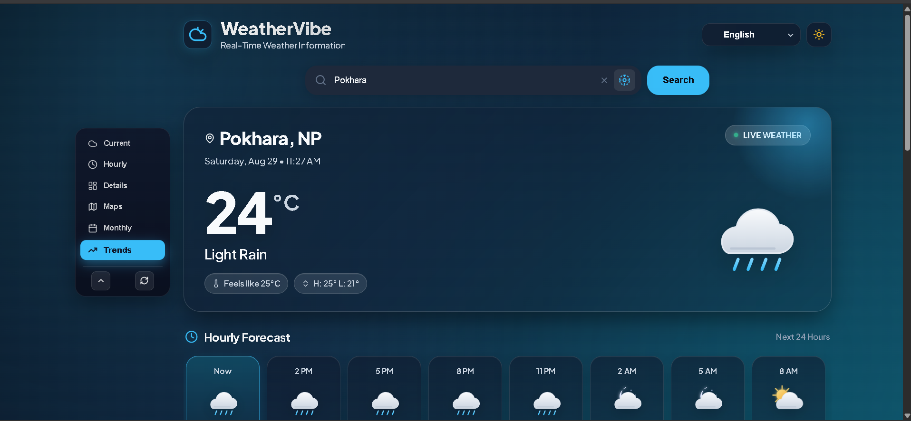

<div align="center">

# 🌦️ WeatherVibe

### Modern • Bilingual • Real-Time Weather Dashboard

A responsive weather dashboard built with **HTML, CSS and JavaScript**, featuring live weather data, forecasts, atmospheric metrics, dynamic weather themes, and English/Nepali language support.

<p>
  <a href="https://kushal0789.github.io/WeatherVibe/">
    
  </a>
  <a href="https://github.com/Kushal0789/WeatherVibe">
    
  </a>
</p>

<p>
  
  
  
  
  
</p>

</div>

---

## ✨ Project Preview


## 🚀 Live Demo

### 👉 [Open WeatherVibe](https://kushal0789.github.io/WeatherVibe/)

Try searching for cities such as Kathmandu, London, Tokyo or New York.

---

## 🌟 Features

- 🌡️ **Real-time weather** — Current temperature and weather conditions
- 🔎 **City search** — Search weather information for different cities
- 📍 **Current location** — Get weather using browser geolocation
- 🕐 **Hourly forecast** — View the upcoming 24 hours
- 📅 **5-day forecast** — Daily temperature and rainfall outlook
- 📊 **Temperature trends** — Interactive 5-day Chart.js visualization
- 💨 **Wind information** — Wind velocity, direction and compass
- 💧 **Humidity** — Atmospheric humidity with interpretation
- 💦 **Dew point** — Dew-point calculation and comfort description
- 🌡️ **Feels-like temperature** — Human-perceived temperature
- 👁️ **Visibility** — Visibility conditions
- 🌬️ **Atmospheric pressure** — Pressure readings and interpretation
- 🌅 **Sunrise & sunset** — Local sunrise and sunset times
- 🌦️ **Dynamic atmosphere** — Background changes based on weather conditions
- 🌙 **Dark mode** — Light/dark theme support
- 🇬🇧 **English** — Full English interface
- 🇳🇵 **नेपाली** — Nepali interface and weather terminology
- 💾 **LocalStorage** — Remembers language, theme and last searched city
- 📱 **Responsive UI** — Designed for desktop and smaller screens
- ♿ **Accessible controls** — Labels, ARIA attributes and keyboard-friendly interactions

---

## 🛠️ Tech Stack

| Technology | Purpose |
|---|---|
| **HTML5** | Page structure and semantic UI |
| **CSS3** | Responsive design, glassmorphism, themes and animations |
| **JavaScript** | Application logic and API integration |
| **OpenWeatherMap API** | Live weather and forecast data |
| **Chart.js** | 5-day temperature trend visualization |
| **Geolocation API** | Weather based on the user's location |
| **LocalStorage** | Persisting user preferences |

---

## 📂 Project Structure

```text
WeatherVibe/
│
├── index.html       # Main dashboard structure
├── style.css        # Design system and responsive styling
├── script.js        # Weather logic, API calls and interactions
├── README.md        # Project documentation
└── assets/
    └── weather-vibe-preview.png
```

---

## 🎨 UI Highlights

WeatherVibe uses a modern dashboard design with:

- Glassmorphism cards
- Dynamic weather-based backgrounds
- Vertical navigation sidebar
- Responsive layouts
- Custom weather illustrations
- Smooth transitions and animations
- Dedicated light and dark themes
- English/Nepali typography

---

## 🌦️ Weather Intelligence

The dashboard presents more than just temperature. It also interprets atmospheric conditions such as:

**Humidity · Wind · Feels Like · Dew Point · Visibility · Pressure · Sunrise · Sunset**

Weather conditions can also change the visual atmosphere of the application, creating different themes for clear skies, clouds, rain, thunderstorms, snow, mist and night conditions.

---

## 🌐 Language Support

WeatherVibe supports:

### 🇬🇧 English

Full interface, weather descriptions, metrics and forecast labels.

### 🇳🇵 नेपाली

नेपाली प्रयोगकर्ताका लागि मौसमको जानकारी, मेनु, सूचकहरू र पूर्वानुमान नेपाली भाषामा उपलब्ध छन्।

---

## 💻 Run Locally

1. Clone the repository:

```bash
git clone https://github.com/Kushal0789/WeatherVibe.git
```

2. Open the project:

```bash
cd WeatherVibe
```

3. Configure your weather API securely.

4. Open `index.html` in a browser, or use a local development server such as VS Code Live Server.

---

## 🔐 API Key Security

WeatherVibe uses the **OpenWeatherMap API** for weather data.

**Important:** Never commit a private API key directly into a public frontend repository.

For a production deployment, use a backend/serverless proxy or another secure architecture so the API credential is not exposed in browser-side JavaScript.

---

## 📸 Screenshots

Add more screenshots here as the project grows.

```text
assets/
├── weather-vibe-preview.png
├── dark-mode.png
├── nepali-language.png
└── mobile-view.png
```

Example:

```markdown
### Dashboard


### Dark Mode


### नेपाली Interface

```

---

## 📈 Future Improvements

Possible future upgrades:

- 🌧️ Real weather radar layers
- 📍 Saved/favorite cities
- 🔔 Severe weather alerts
- 📱 Installable PWA
- 🌍 More language support
- 📈 More advanced historical weather charts
- 🗺️ Interactive weather maps
- ⚡ Improved API security with a backend proxy

---

## 👨‍💻 Developer

**Kushal0789**

Built as a web development project to explore real-time APIs, responsive UI design, JavaScript application logic and weather data visualization.

---

<div align="center">

### 🌦️ WeatherVibe

**Real-Time Weather Intelligence • English & नेपाली**

[🚀 Live Demo](https://kushal0789.github.io/WeatherVibe/) · [💻 GitHub Repository](https://github.com/Kushal0789/WeatherVibe)

</div>
